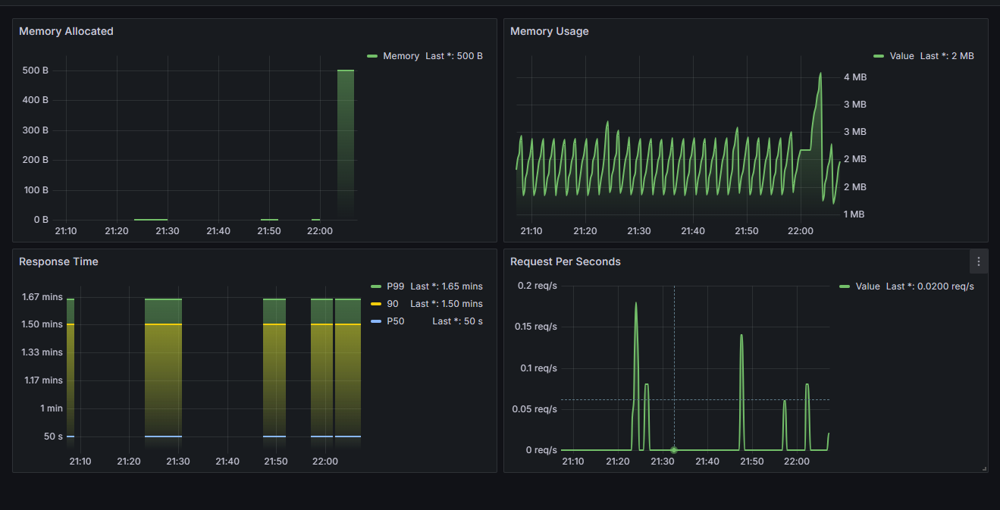

# Apa Itu Observability?

Observability adalah proses pembuatan sebuah sistem internal lebih transparant. Sistem observability dapat dibuat dari data yang mereka hasilkan. Observability biasanya dibagi menjadi 3 kategori yaitu:

1. Metrics
2. Logs
3. Tracing

Observability mengacu pada kemampuan untuk monitor, mengukur dan mengerti keadaan dalam suatu sistem atau aplikasi. Dalam modern sistem software dan cloud computing, Observability memainkan peran yang sangat penting untuk memastikan reliability, performance, dan keamanan aplikasi dan infrastruktur. Pentingnya observability telah berkembang karena meningkatnya software sistem, adopsi layanan microservice dan meningkatnya ketergantungan distributed architectures.

# Data Apa Yang Dikumpulkan

Ada 3 fundamental type data yang dikumpulkan adalah metrics, logs dan traces:

1. Metrics
   Fokus untuk mengumpulkan quantitative data tentang kubernetes env kamu dan aplikasi kamu. Metrics dapat mencakup data seperti CPU dan memory usage, network traeffic, dan request latency.
2. Logs
   Fokus untuk mengumpulkan dan menganalisis log data dari kubernetes env dan aplikasi. Logs dapat memberikan nilai berharga tentang behavior aplikasi kamu, dan kamu bisa menggunakan untuk memecahakan issue, identifikasi performance bottlenecks, dan mendeteksi ancaman keamanan.
3. Tracer
   Fokus untuk mengumpulkan data mengenai eksekusi dari request atau transaksi diseluruh env kubernetes dan aplikasi kamu, tracer bisa membantu kamu mengerti bagaimana request atau transaksi diproses dari aplikasi kamu, identifikasi performa issue, dan optimize performa aplikasi kamu.

